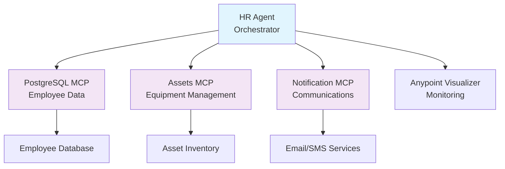

# Employee Onboarding Agent Network
## Anypoint Platform with Agentic Fabric Capabilities

A complete employee onboarding solution built with MuleSoft's Anypoint Platform featuring agentic fabric architecture with Model Context Protocol (MCP) servers for intelligent agent-to-agent communication.

## 🌟 Overview

This project demonstrates a modern, intelligent employee onboarding system using:
- **Anypoint Platform** for enterprise integration
- **CloudHub 2.0** for scalable cloud deployment
- **Agentic Fabric** for intelligent agent orchestration
- **MCP Servers** for seamless agent-to-agent communication
- **Anypoint Visualizer** for real-time monitoring

## 🏗️ Architecture



## 🚀 Features

### Core Capabilities
- **Intelligent Employee Onboarding**: Automated workflow orchestration
- **Asset Management**: Equipment allocation and tracking
- **Multi-Channel Notifications**: Email and SMS welcome messages
- **Real-time Monitoring**: Anypoint Visualizer integration
- **Scalable Architecture**: CloudHub 2.0 deployment ready

### MCP Server Tools
| Server | Tools Available | Description |
|--------|----------------|-------------|
| **PostgreSQL MCP** | `create-employee`<br/>`get-employee` | Employee data management with database persistence |
| **Assets MCP** | `allocate-assets`<br/>`get-asset-inventory` | Equipment allocation and inventory tracking |
| **Notification MCP** | `send-welcome-email`<br/>`send-sms` | Multi-channel communication services |

### Technical Features
- **Maven-based Projects**: Proper Anypoint Studio format
- **MCP Connector Integration**: Latest v1.3.0 for agent fabric
- **Environment Configuration**: Property-based configuration management
- **Error Handling**: Comprehensive error handling and logging
- **DataWeave Transformations**: Intelligent data processing

## 📁 Project Structure

```
employee-onboard-agent/
├── 📋 README.md                       # This file
├── 📖 DEPLOYMENT-GUIDE.md             # Detailed deployment instructions
├── 🤖 agent-network.yaml              # Agent network configuration
├── 📦 exchange.json                   # Exchange metadata
├── 🚀 anypoint-deployment/            # Deployment configurations
│   ├── agent-network-anypoint.yaml   # CloudHub-specific config
│   ├── exchange-anypoint.json         # Exchange publication config  
│   ├── .env.anypoint.template         # Environment template
│   └── deploy-to-anypoint.sh          # Automated deployment script
├── 🗄️ postgres-mcp-onboarding/        # Employee Database MCP Server
│   ├── pom.xml                        # Maven configuration
│   ├── src/main/mule/
│   │   ├── global.xml                 # Global configurations
│   │   └── postgres-mcp-onboarding.xml # Database operations
│   └── src/main/resources/
│       └── config.properties          # Database configuration
├── 📦 assets-mcp-server/              # Equipment Management MCP Server
│   ├── pom.xml                        # Maven configuration
│   ├── src/main/mule/
│   │   ├── global.xml                 # Global configurations
│   │   └── assets-mcp-server.xml      # Asset operations
│   └── src/main/resources/
│       └── config.properties          # Asset configuration
├── 📧 notification-mcp-server/        # Communications MCP Server
│   ├── pom.xml                        # Maven configuration
│   ├── src/main/mule/
│   │   ├── global.xml                 # Global configurations
│   │   └── notification-mcp-server.xml # Notification operations
│   └── src/main/resources/
│       └── config.properties          # Email/SMS configuration
├── 📋 api-specs/                      # API Specifications
│   └── employee-onboarding-api.yaml   # OpenAPI specification
└── 🛡️ flex-gateway-policies/          # Security Policies
    ├── authentication-policy.yaml     # Authentication policy
    ├── rate-limiting-policy.yaml      # Rate limiting policy
    └── httproute.yaml                  # HTTP routing configuration
```

## 🚀 Quick Start

### Prerequisites
- Anypoint Studio 7.15+ or Anypoint Code Builder
- Maven 3.8+
- Java 17
- Anypoint Platform account with CloudHub 2.0 access

### 1. Clone and Setup
```bash
git clone https://github.com/nkumar819860/employee-onboard-agent.git
cd employee-onboard-agent
git checkout dev
```

### 2. Configure Environment
```bash
cp anypoint-deployment/.env.anypoint.template .env
# Edit .env with your Anypoint Platform credentials
```

### 3. Build Projects
```bash
# Build all MCP servers
cd postgres-mcp-onboarding && mvn clean package && cd ..
cd assets-mcp-server && mvn clean package && cd ..
cd notification-mcp-server && mvn clean package && cd ..
```

### 4. Deploy to Anypoint Platform
```bash
# Use automated deployment script
chmod +x anypoint-deployment/deploy-to-anypoint.sh
./anypoint-deployment/deploy-to-anypoint.sh
```

### 5. Verify Deployment
```bash
# Check MCP server health
curl -X GET https://postgres-mcp-sandbox.us-east-1.cloudhub.io/mcp/tools
curl -X GET https://assets-mcp-sandbox.us-east-1.cloudhub.io/mcp/tools
curl -X GET https://notification-mcp-sandbox.us-east-1.cloudhub.io/mcp/tools
```

## 📚 Documentation

- **[📖 Detailed Deployment Guide](DEPLOYMENT-GUIDE.md)** - Complete step-by-step deployment instructions
- **[🤖 Agent Network Configuration](agent-network.yaml)** - Main agent network setup
- **[📦 Exchange Configuration](exchange.json)** - Anypoint Exchange metadata
- **[🚀 CloudHub Deployment](anypoint-deployment/)** - CloudHub 2.0 specific configurations

## 🔧 Configuration

### Environment Variables
Key environment variables needed for deployment:

```bash
# Anypoint Platform
ANYPOINT_ORG_ID=your-org-id
ANYPOINT_ENV=Sandbox
ANYPOINT_CLIENT_ID=your-client-id
ANYPOINT_CLIENT_SECRET=your-client-secret

# CloudHub 2.0
CLOUDHUB_REGION=us-east-1
CLOUDHUB_DOMAIN=your-domain

# Database
POSTGRES_HOST=your-postgres-host
POSTGRES_PASSWORD=your-password

# External Services
OPENAI_API_KEY=your-openai-key
EMAIL_HOST=smtp.gmail.com
EMAIL_PASSWORD=your-email-password
```

### Port Configuration
- **PostgreSQL MCP**: Port 8081
- **Assets MCP**: Port 8082  
- **Notification MCP**: Port 8083

## 🧪 Testing

### Local Testing
```bash
# Start PostgreSQL MCP Server locally
cd postgres-mcp-onboarding
mvn mule:run

# Test endpoints
curl -X GET http://localhost:8081/mcp/tools
curl -X POST http://localhost:8081/mcp/tools/create-employee \
  -H "Content-Type: application/json" \
  -d '{"name":"John Doe","email":"john@company.com"}'
```

### End-to-End Workflow Test
```bash
# 1. Create Employee
curl -X POST https://postgres-mcp-sandbox.us-east-1.cloudhub.io/mcp/tools/create-employee \
  -H "Content-Type: application/json" \
  -d '{"name":"Jane Smith","email":"jane@company.com"}'

# 2. Allocate Assets  
curl -X POST https://assets-mcp-sandbox.us-east-1.cloudhub.io/mcp/tools/allocate-assets \
  -H "Content-Type: application/json" \
  -d '{"employeeId":"123","assets":["laptop","id-card","bag"]}'

# 3. Send Welcome Notification
curl -X POST https://notification-mcp-sandbox.us-east-1.cloudhub.io/mcp/tools/send-welcome-email \
  -H "Content-Type: application/json" \
  -d '{"employeeId":"123","email":"jane@company.com","name":"Jane Smith"}'
```

## 📊 Monitoring

### Anypoint Visualizer
- Real-time application topology
- Message flow visualization  
- Performance metrics
- Health monitoring

### Available Metrics
- Employee onboarding requests
- Asset allocation success rate
- Notification delivery status
- MCP server response times

## 🛠️ Development

### Adding New MCP Tools
1. Create new flow in respective MCP server
2. Add tool definition to `/mcp/tools` endpoint
3. Implement tool logic with proper error handling
4. Update documentation and tests

### MCP Server Structure
```xml
<!-- Tool listing endpoint -->
<flow name="mcp-tools-list">
    <http:listener path="/mcp/tools" allowedMethods="GET"/>
    <!-- Tool definitions -->
</flow>

<!-- Individual tool implementation -->
<flow name="your-tool-mcp">
    <http:listener path="/mcp/tools/your-tool" allowedMethods="POST"/>
    <!-- Tool implementation -->
</flow>
```

## 🤝 Contributing

1. Fork the repository
2. Create feature branch (`git checkout -b feature/amazing-feature`)
3. Commit changes (`git commit -m 'Add amazing feature'`)
4. Push to branch (`git push origin feature/amazing-feature`)
5. Open Pull Request

## 📄 License

This project is licensed under the MIT License - see the [LICENSE](LICENSE) file for details.

## 🆘 Support

### Resources
- [MuleSoft Documentation](https://docs.mulesoft.com)
- [CloudHub 2.0 Guide](https://docs.mulesoft.com/runtime-manager/cloudhub-2)
- [Agent Fabric Documentation](https://docs.mulesoft.com/agent-fabric)
- [MCP Connector Guide](https://docs.mulesoft.com/mcp-connector)

### Contact
- **Issues**: [GitHub Issues](https://github.com/nkumar819860/employee-onboard-agent/issues)
- **Documentation**: [Deployment Guide](DEPLOYMENT-GUIDE.md)
- **Community**: [MuleSoft Community](https://help.mulesoft.com/s/)

---

## 🎯 Key Benefits

- **🚀 Rapid Deployment**: CloudHub 2.0 ready with automated deployment scripts
- **🤖 Intelligent Orchestration**: Agentic fabric with MCP servers for seamless communication  
- **📊 Real-time Visibility**: Anypoint Visualizer integration for monitoring
- **🔧 Enterprise Ready**: Proper Maven structure for Anypoint Studio compatibility
- **📈 Scalable Architecture**: Multi-replica deployment with load balancing
- **🛡️ Security First**: OAuth2 authentication and Flex Gateway policies

**Ready to transform your employee onboarding process with intelligent automation!** 🎉
